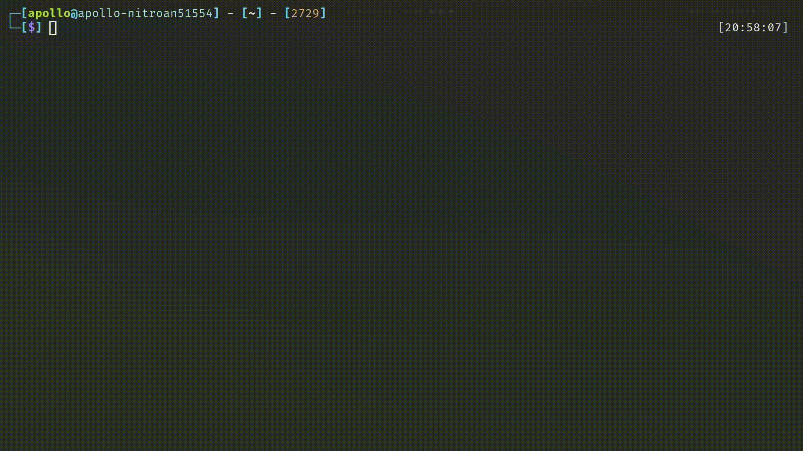

# Todo App Rust

### Preview


This is a todo cli app made in Rust that uses sqlite3 for data storage.


Usage:
```
todo_rs <command> <name or index>
```

Some commands like remove, mark and unmark can be used using the index.
<br>

Install using the following command:
```
cargo build --release && sudo cp target/release/todoapp /usr/local/bin/todo_rs && sudo chmod a+x /usr/local/bin/todo_rs
```

<br>

Database is located on a subfolder called `.todo_rs` located on user Home folder.

On Windows: `C:\Users\<USER>\.todo_rs\todo.db`<br>
On Linux: `/home/<USER>/.todo_rs/todo.db`<br>
On Mac: `/Users/<USER>/.todo_rs/todo.db`

### Dependencies
- [rusqlite](https://crates.io/crates/rusqlite) -  Ergonomic wrapper for SQLite 
- [simple-home-dir](https://crates.io/crates/simple-home-dir) - Retrieve user directory